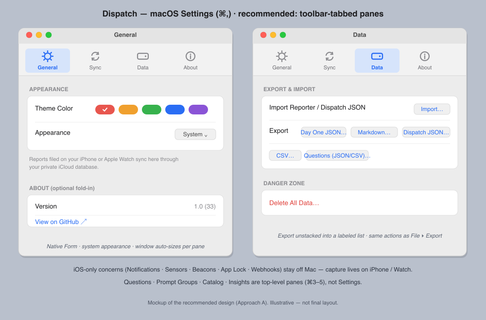

# macOS Settings redesign — design proposal

- **Date:** 2026-07-14
- **Status:** proposal for owner review — NOT approved, NOT merge-ready
- **Related:** plan 36 (Mac shell), `2026-07-13-ipad-mac-ui-convergence-design.md` (§8 Settings restructure), plan 24 (webhooks), plan 37 (sync diagnostics)
- **Scope:** the macOS **Settings scene** (⌘,) only. iPhone/iPad settings untouched.

## Mockup (recommended design)



*Two panes of the recommended toolbar-tabbed design: General (Appearance + an
optional About fold-in) and Data (Export/Import + Danger Zone). Illustrative,
not a final layout.*

## 1. Problem

Owner: *"it's just a single window and it's a mess."*

macOS Settings today is one bespoke `Form` in one window:

```swift
// DispatchMacApp.swift:171
Settings { MacSettingsView() }
```

`MacSettingsView` is a single `.formStyle(.grouped)` `Form` pinned to
`.frame(width: 480)` with **no height constraint**, holding four unrelated
concerns in one scroll:

1. **Sync** — iCloud toggle + "last store change observed"
2. **Theme** — a color `Picker`
3. **Data** — an Import button plus **four export buttons crammed into two
   `LabeledContent` rows** (Day One JSON, Markdown, Dispatch JSON, CSV)
4. **About** — version, sync-container id, GitHub link

Why it reads as a mess on macOS specifically:

- **No categorization.** Sync, appearance, data, and about share one scroll.
  Native Mac apps split these into titled panes.
- **iOS `Form` idioms in a Mac window.** Grouped-list rows and stacked
  `LabeledContent` are the iPhone Settings vocabulary; a Mac preferences window
  expects labeled left-aligned controls and toolbar tabs.
- **Fixed 480pt width, free height.** One frame is imposed on four unrelated
  concerns, so every pane pays for the widest one and the export button row is
  cramped. (A tabbed window doesn't *auto*-size — see §3 — but it does let each
  pane declare its own frame instead of sharing one.)
- **No native affordances.** No toolbar tabs, no search — none of the
  modern-System-Settings or classic-preference-pane cues a Mac user reaches for.

**One correction to the framing.** The Mac window does *not* reuse the iOS
pushed-list `SettingsView`. It's a separate, deliberately smaller view (its own
header calls it "plan 36's deliberate subset"). The iOS `SettingsView` — the
themed `List` with MANAGE / SCHEDULE / SURVEY / PRIVACY / DATA / INTERFACE /
ABOUT sections — drives iPhone (push) and iPad (a sheet, via the in-flight
convergence branch's `shell-settings-button`) only. So the redesign is about
giving the Mac's *already-correct subset* a native **shell**, not about porting
every iOS setting.

## 2. The real settings inventory

Source of truth: `App/Sources/Settings/`. The full iOS surface, and where each
piece belongs on Mac (Mac = review / analyze / export; **no capture, sensors,
notifications, app-lock, or webhooks**):

**The top-level pane contract (not Settings).** The Mac shell's panes are
**Dashboard ⌘1, Insights ⌘2, Questions ⌘3, Prompt Groups ⌘4, Question Catalog
⌘5** (`Mac/Sources/DispatchMacApp.swift`, the Manage menu → `PaneNavigation`).
All five are top-level panes; **none of them belong in Settings**, and Insights
is a first-class pane (⌘2) — it must not be omitted from the shell nor
duplicated as a Settings tab.

| iOS section | Contents | On Mac |
|---|---|---|
| **MANAGE** | Questions, Prompt Groups, Catalog | **Already panes** (⌘3/4/5), not Settings |
| **SCHEDULE** | Notifications (focus filter, sleep, frequency, distribution, scheduled times, persistent reminders, digests), Beacons, Weekly Digest, Insights | **Insights is already a pane (⌘2)**, not Settings; the rest are **iOS-only** (no scheduling/monitoring on Mac) |
| **SURVEY** | Custom Tokens, People, Sensors (focus filter, media/Spotify, contacts, units) | Sensors/Spotify **iOS-only**; Tokens/People are sync-backed vocab — *candidate* for Mac |
| **PRIVACY** | Require Face ID, Spotlight-while-locked | **iOS-only** (AppLockStore, Spotlight) |
| **DATA** | Import & Export, Backups, Advanced → Webhook, Delete All Data | Import/Export + Delete → **Mac-relevant**; Webhook **iOS-only**. **Delete All Data REQUIRES `BackupManager`** (its first gate is the "also delete backups" choice), so the Settings scene must inject it — see below |
| **iCloud** | Sync toggle, account status, last change, Diagnostics, Back Up Now | **Mac-relevant** (SyncPolicy + RemoteChangeObserver already injected). **`BackupManager` must also be injected** — it's a hard requirement for Delete All Data, and it makes *Back Up Now* free |
| **INTERFACE** | Theme swatches | **Mac-relevant** |
| **ABOUT / SOURCE** | Version, blurb, GitHub | **Mac-relevant** |

**Genuinely-Settings-on-Mac = Appearance, Sync/iCloud, Data, About** (plus an
optional Vocabulary surface). Everything else is either a pane already or an
iOS-only capture concern. This matches convergence-doc §8 ("Settings slims to
true configuration") — the Mac subset is even smaller because capture lives on
iPhone/Watch.

### Reuse reality (grounded in `project.yml`)

- Only four `Settings/` files are dual-target today —
  `QuestionSettingsView`, `QuestionEditorView`, `ChoiceOptionsEditorView`,
  `PromptGroupsView` — and those became **panes**, not Settings.
- The Settings-proper content (`ICloudSettingsView`, `DataSettingsView`,
  `SyncDiagnosticsView`, `CustomTokensView`) is iOS-target-only but mostly
  UIKit-free (only `SensorSettingsView` imports UIKit). It's *portable*, but it
  carries iOS presentation — `navigationBarTitleDisplayMode`,
  `.toolbarColorScheme(.dark, for: .navigationBar)`, `.readableColumn()`, and
  the dark themed rows (`Color.white.opacity(0.12)` on `themeBackground`) — that
  looks wrong in a native preferences window.
- The Settings scene injects only `themeStore`, `remoteChangeObserver`,
  `exportController`, `appDefaults`. `BackupManager`, `AppLockStore`,
  `NotificationScheduler`, `WebhookManager`, etc. are **not** injected — a
  structural confirmation that the iOS-only panes don't belong here.

**Key inversion vs. the pane convergence:** panes adopted the iOS *themed dark*
look inside a shared shell. **Settings should do the opposite** — reuse the
backing *logic/controllers*, but present in the **system-native** appearance a
preferences window is expected to have. Settings is a system surface, not app
chrome.

## 3. macOS conventions

- **`Settings { TabView }` → classic toolbar-tab preference panes.** Wrapping a
  `TabView` in the SwiftUI `Settings` scene produces the familiar toolbar-tabbed
  window (Safari, Mail, Xcode, Notes). Each `.tabItem` is a titled toolbar icon;
  ⌘, opens/refocuses it; it's a separate window from the main one. Near-free, and
  the idiomatic answer for a **small, stable** set of categories.
- **System-Settings-style sidebar + detail.** A `NavigationSplitView` of
  categories with a detail pane. This is what modern *System Settings* uses —
  because it has **dozens** of categories and a search field. Right for many
  panes; heavy for four.
- **Sizing is NOT automatic — the panes own it.** The Settings window sizes to
  its content, but SwiftUI gives you no per-pane auto-sizing: each pane declares
  its own frame. Give every pane the *same* sensible min width (~500pt) and let
  height fit its content, so switching tabs doesn't jump the window around. (Do
  not plan on the window "auto-resizing per pane" — that is not a built-in.)
- **Tab targeting is NOT built-in.** `SettingsLink` opens/foregrounds the
  Settings scene; it does **not** select a tab. Deep-linking to a specific pane
  requires custom selection state (`@State`/`@AppStorage` bound to the
  `TabView`'s `selection:`) plus something to set it. Treat per-pane
  deep-linking as opt-in work, not a freebie (see §7 open questions).
- **Search.** Only System-Settings-scale surfaces ship a search field. A
  four-pane app doesn't need one.

For Dispatch's ~4 Mac categories, the toolbar-tab convention is the native fit.

## 4. Approaches

### A — Toolbar-tabbed preference panes  ★ recommended

```swift
Settings {
    TabView {
        GeneralSettingsPane().tabItem { Label("General", systemImage: "gearshape") }
        SyncSettingsPane().tabItem    { Label("Sync",    systemImage: "arrow.triangle.2.circlepath") }
        DataSettingsPane().tabItem    { Label("Data",    systemImage: "externaldrive") }
        AboutSettingsPane().tabItem   { Label("About",   systemImage: "info.circle") }
    }
}
```

Each pane is a native `Form`/`.formStyle(.grouped)` in system appearance.

- **Pros:** most idiomatic for a handful of panes; almost free in SwiftUI; each
  pane sizes itself instead of everything sharing one fixed 480pt frame (which is
  what jams the exports today); matches user muscle memory; keeps Settings a
  system-native surface (correct inverse of the pane theming).
- **Cons:** doesn't scale to many panes (fine — Mac has ~4 and won't grow, since
  capture stays on iOS); no built-in search (not needed at this size); **no
  built-in tab targeting** — `SettingsLink` only opens/foregrounds the scene, so
  deep-linking to a pane means carrying explicit `TabView` selection state.

### B — System-Settings-style sidebar + detail

A `NavigationSplitView` (category sidebar | detail) inside the Settings scene —
visually echoes the app's own `LargeScreenShell`.

- **Pros:** consistent with the app's shell metaphor; room to grow; a sidebar
  search field is natural.
- **Cons:** overkill for four categories (System Settings earns it with dozens);
  materially more custom code — selection state, window sizing/restoration, a
  non-idiomatic split-view *inside* a preferences window; reintroduces the
  dual-column toolbar/`.searchable` fragility the repo already hit (build 30's
  crash). High effort, low payoff at this scale.

### C — Lighter reorg of the single window

Keep one `Form`, but regroup into clearer `Section`s, fix a sensible min/ideal
size, and unstack the export buttons.

- **Pros:** smallest change; no new scene structure.
- **Cons:** still one scrolling window adopting **no** native convention — the
  exact thing the owner already called a mess. A stopgap, not a redesign.

**Recommendation: A.** It's the Apple-idiomatic answer for an app with a small,
fixed set of preference categories, lets each pane own its frame instead of
cramming four concerns into one, and — unlike B — keeps Settings in the system
appearance where it belongs. B's shell consistency is a red herring: panes and
preferences are different surface classes on macOS, and users expect preferences
to look like preferences.

## 5. Proposed structure (Approach A)

Four tabs (fold to three if About merges into General):

- **General** — `gearshape`
  - Appearance: theme picker/swatches (`ThemeStore`, already injected).
  - A one-line "Reports filed on your iPhone or Apple Watch sync here" note.
- **Sync** — `arrow.triangle.2.circlepath`
  - iCloud Sync toggle + "takes effect after reopening" note (`SyncPolicy`).
  - Account status (`CKAccountStatus`, async `.task`) + last store change observed.
  - Diagnostics → opens `SyncDiagnosticsView` (sheet or nested).
  - *Back Up Now* — included. **`BackupManager` MUST be injected into the
    Settings scene** regardless (Delete All Data depends on it, below), so this
    control comes along for free. This is a decision, not a conditional: a Data
    pane without `BackupManager` cannot render the delete flow correctly.
- **Data** — `externaldrive`
  - Import (`MacExportController.importJSON`).
  - Export as a clean labeled list, not a 4-button jam: Day One JSON, Markdown
    folder, Dispatch JSON, CSV, Questions JSON, Questions CSV — the same actions
    already in the File → Export menu.
  - **Delete All Data — preserve BOTH existing gates verbatim.** The current iOS
    flow (`App/Sources/Settings/DataSettingsView.swift`) is deliberately
    two-stage, and the Mac pane must reproduce it, not collapse it into a
    generic "are you sure?":
    1. **Scope gate** — an alert explaining the scope that also carries the
       **backup choice**: *"Also delete backups"* is a **separate, secondary
       destructive action and defaults to OFF**, because backups are the safety
       net. (This is why `BackupManager` is required.)
    2. **Typed confirmation** — a `TextField` requiring the user to type
       **`DELETE`**; the destructive action stays disabled until it matches.

    Dropping either gate — or silently deleting backups along with the data —
    is a **data-loss regression**, not a simplification.
- **About** — `info.circle`
  - Version + build, sync-container id, "carrying the torch of Reporter" blurb,
    GitHub link.

*Optional* **Vocabulary** tab (`textformat`): Custom Tokens (+ People) — both are
SwiftData-backed, sync, and compile cleanly on Mac; gives Mac users a place to
prune vocabulary. Left as an open question (arguably content, not settings).

**Window/behavior**
- **Each pane sets its own frame** — there is no per-pane auto-sizing (§3). Give
  every pane the same min width (~500pt) and let height fit, so tab switches
  don't jump the window.
- ⌘, opens/refocuses; File-menu Import/Export stays (Settings duplicates the
  common actions, as today).
- **Deep-linking to a pane is NOT free.** `SettingsLink` opens/foregrounds the
  Settings scene but does not select a tab. If we want "jump to Data", we must
  carry explicit `TabView` selection state (e.g. `@AppStorage` bound to
  `selection:`) and set it from the caller. **Out of scope for v1** — listed as
  an open question, not a promised affordance.
- Search: out for v1.

**Coexistence with iOS/iPad** — mirror the convergence philosophy, **inverted for
a system surface**: share the *backing stores/controllers* (`ThemeStore`,
`SyncPolicy`, `MacExportController`, `SyncDiagnosticsView`, `BackupManager`),
present them in a **Mac-native** Form. iPhone keeps its themed pushed `List`;
iPad keeps its themed sheet. The genuinely-shared controls are few enough that
Mac-native pane views calling shared stores is cleaner than forcing one `#if
os`-riddled View layer to render both the dark themed list *and* the system Form.

## 6. Scope / non-goals / open questions

**In scope**
- Replace `Settings { MacSettingsView() }` with a tabbed (or sidebar) Mac-native
  Settings; regroup the existing Mac subset into panes; fix sizing + the export
  button jam.

**Non-goals**
- No new *settings* — this is a shell/structure redesign of the existing subset.
- No porting of iOS-only settings (Notifications, Sensors, Beacons, Spotify,
  App Lock, Webhooks) to Mac — they depend on capture and on stores the Mac app
  deliberately doesn't run.
- No change to iPhone/iPad Settings, the panes, sync, or the data model.

**Open questions for the owner**
1. **Approach A (toolbar tabs) vs B (sidebar)?** I recommend A; B only pays off
   if you foresee many more Mac categories (you shouldn't, given capture is iOS).
2. **Tab count:** 4 tabs (General / Sync / Data / About), or fold About into
   General for 3? And — include a **Vocabulary** tab (Custom Tokens / People) on
   Mac, or leave vocabulary off Mac entirely?
3. **Appearance:** system-native Settings (my recommendation), or carry the
   app's dark theme into Settings for brand continuity? (I'd keep Settings
   system-native — it's the correct inverse of the themed panes.)
4. **Reuse layer:** share the backing stores + small Mac-native pane views
   (my recommendation), or share the SwiftUI View layer across platforms with
   `#if os` guards (more DRY, more friction, appearance mismatch)?
5. **Per-pane deep-linking ("jump to Data"):** worth carrying explicit `TabView`
   selection state for, or leave it out? `SettingsLink` alone does **not** select
   a tab (§3), so this is real work, not a freebie. Out of scope for v1 unless
   you want it.

**Decided (no longer open)**
- **`BackupManager` is injected into the Settings scene — not optional.** The
  Data pane's Delete All Data flow depends on it: its first gate is the *"Also
  delete backups"* choice (default OFF). Shipping the Data pane without
  `BackupManager` would drop a safety gate and silently change delete semantics.
  Injecting it also brings *Back Up Now* along at no extra cost, which settles
  the former "sync depth on Mac" question.
